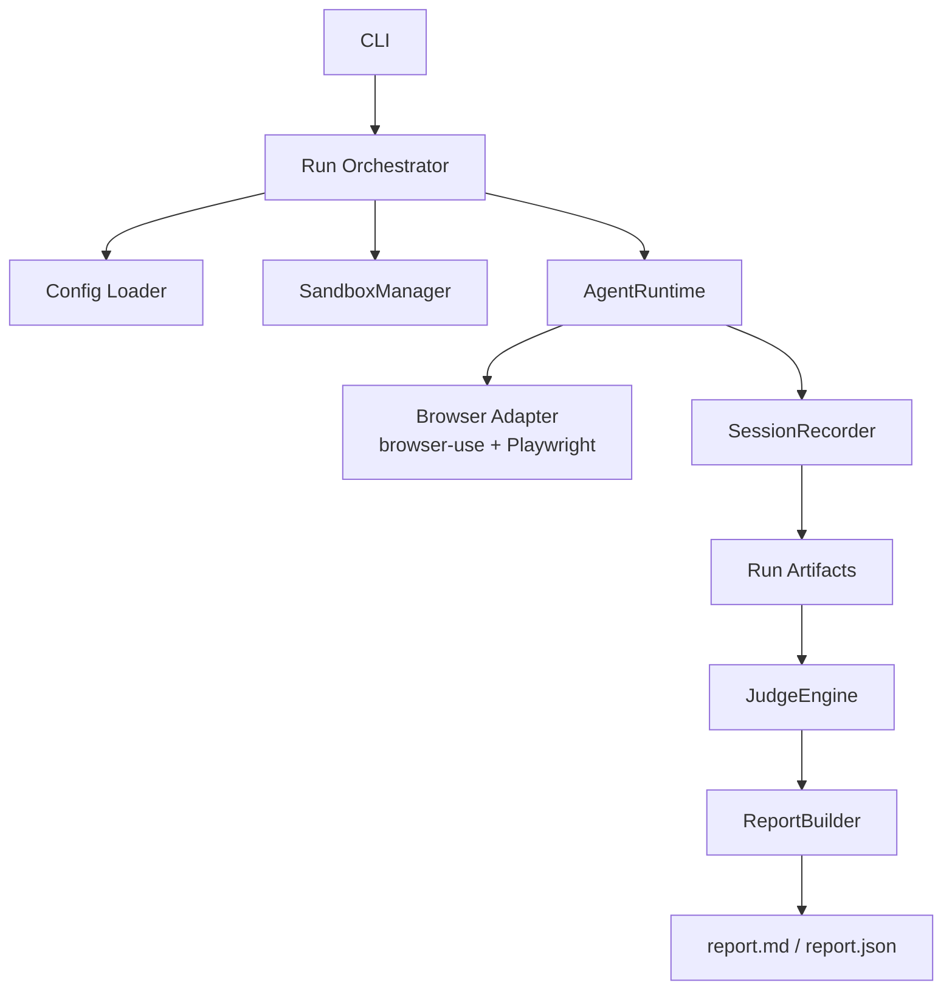

# Doppel 系统架构说明

## MVP 架构文档 · v0.2

---

## 1. 目标

这份文档只回答 4 个问题：

1. Doppel 的系统边界是什么
2. 一次 run 经过哪些环节
3. 每个模块负责什么
4. MVP 为什么选这套技术栈

一句话定义：

> Doppel 是一个在可控 sandbox 中运行 synthetic user 的体验测试系统。

CLI 只是入口，不是产品本体。

---

## 2. 系统边界

### 2.1 Doppel 包含什么

MVP 的 Doppel 由 4 个核心子系统组成：

- `SandboxManager`
- `AgentRuntime`
- `JudgeEngine`
- `ReportBuilder`

外围还有两个支撑层：

- `CLI / Config`
- `Session Artifacts`

### 2.2 Doppel 不包含什么

MVP 不做：

- SaaS 平台
- 多租户隔离
- 大规模并发调度
- 原生移动端自动化
- 人工标注平台
- 审美 judge 蒸馏

---

## 3. 总体架构



分层关系：

- `CLI` 负责触发
- `SandboxManager` 负责准备环境
- `AgentRuntime` 负责执行体验过程
- `SessionRecorder` 负责固化证据
- `JudgeEngine` 负责把证据变成结论
- `ReportBuilder` 负责输出结果

交互原则：

- 感知层 `visual-first`
- 决策层依据截图和视觉线索选择动作
- 执行层通过浏览器完成真实点击、输入、滚动
- DOM 可以辅助执行，但不能主导 agent 认知

---

## 4. 一次 Run 的执行流程

### 4.1 主流程

1. 读取 `product.yaml`、`skill.yaml`、可选 `personas.yaml`
2. 校验配置并归一化为 `RunSpec`
3. `SandboxManager` 准备浏览器上下文、账号、入口 URL、reset hook
4. 解析 persona；如缺失则自动生成默认 persona
5. `AgentRuntime` 启动 agent，执行 observe-decide-act 循环
6. `SessionRecorder` 持续落盘步骤、截图、状态和 stop reason
7. `JudgeEngine` 先抽 facts，再按 criteria 评分
8. `ReportBuilder` 生成 Markdown / JSON 报告

### 4.2 运行终止条件

一次 run 在以下任一条件满足时结束：

- mission 完成
- 命中 `stop_conditions`
- 达到 `max_steps`
- 达到 `max_runtime_seconds`
- 浏览器或页面进入不可恢复错误

---

## 5. 核心模块

### 5.1 Config Layer

职责：

- 读取 YAML
- 校验字段
- 解析环境变量
- 输出规范化配置

输入：

- `product.yaml`
- `skill.yaml`
- `personas.yaml`
- `doppel.config.yaml`

输出：

- `RunSpec`

### 5.2 SandboxManager

职责：

- 为一次 run 准备可控环境
- 创建独立 browser context
- 注入测试账号
- 执行 reset hook
- 维护起始状态

接口：

```text
prepare(spec: RunSpec) -> SandboxContext
reset(ctx: SandboxContext) -> ResetResult
teardown(ctx: SandboxContext) -> None
```

MVP 支持两类 sandbox：

- `RemoteUrlSandbox`
- `LocalPreviewSandbox`

### 5.3 AgentRuntime

职责：

- 组装 runtime prompt
- 执行 observe-decide-act loop
- 检查 stop conditions
- 把每一步交给 `SessionRecorder`

AgentRuntime 不负责打分，只负责“发生了什么”。

AgentRuntime 的输入应以视觉上下文为主：

- 当前 viewport screenshot
- 当前 URL
- 历史动作摘要
- mission / persona / stop conditions

不应把原始 HTML、CSS、完整 DOM 直接作为主感知输入喂给 agent。

### 5.4 感知与交互模型

MVP 采用 `visual-first, DOM-assisted, not DOM-driven`。

具体定义如下：

- `Perception`：agent 主要基于截图理解当前页面
- `Decision`：agent 输出“点哪里 / 输入什么 / 滚到哪里”
- `Execution`：浏览器层把决策转成真实点击、输入、滚动
- `Validation`：执行后检查页面是否真的发生状态变化

这条设计是 Doppel 和传统 E2E 的关键区别。

如果只基于 DOM，系统更容易测成“结构上能不能操作”；
如果基于视觉，系统才能测到“用户会不会把这里当成可操作入口”。

因此，MVP 应遵守以下约束：

- 不使用 selector 作为 agent 的主决策语言
- 不把 DOM 节点树作为主要认知上下文
- 允许浏览器层在执行阶段使用 DOM 命中元素或坐标点击
- 记录“看起来能点但点了无反应”的失败情况

### 5.5 Browser Adapter

职责：

- 打开页面
- 截图
- 执行动作
- 读取页面状态

MVP 采用：

- `browser-use` 作为 agent browser layer
- `Playwright` 作为浏览器控制层

执行策略建议：

- 优先支持基于视觉目标或屏幕区域的点击
- Playwright 负责实际事件注入和状态读取
- 必要时可使用 DOM 辅助定位，但这属于执行优化，不属于感知输入

### 5.6 SessionRecorder

职责：

- 记录 step event
- 管理截图路径
- 写入 run 元数据
- 固化 stop reason 和错误信息

输出：

- `session.json`
- `screenshots/*.png`
- `run_meta.json`

### 5.7 JudgeEngine

职责：

- Pass 1：事实提取
- Pass 2：criteria 评估

输出：

- `facts.json`
- `evaluation.json`

JudgeEngine 只读 artifact，不直接参与 runtime。

### 5.8 ReportBuilder

职责：

- 汇总 run 结果
- 输出人类可读报告
- 输出程序可消费结果

输出：

- `report.md`
- `report.json`

---

## 6. 核心数据对象

### 6.1 RunSpec

`RunSpec` 是一次 run 的规范化输入，建议包含：

- `product`
- `persona`
- `skill`
- `sandbox`
- `model_config`
- `run_limits`

### 6.2 SandboxContext

`SandboxContext` 是一次 run 的环境句柄，建议包含：

- `run_id`
- `entry_url`
- `browser_context`
- `auth_context`
- `artifact_dir`
- `seed_state`

### 6.3 StepEvent

每一步至少记录：

- `step_id`
- `timestamp`
- `url`
- `page_title`
- `action_type`
- `action_input`
- `target_description`
- `observation_summary`
- `reasoning_summary`
- `screenshot_path`
- `elapsed_ms`
- `status`

其中 `target_description` 用来记录 agent 以视觉语言理解的目标，例如：

- `primary CTA near hero section`
- `"Start free" button in top-right`
- `search field in center panel`

### 6.4 Fact

Pass 1 输出的事实建议包含：

- `fact_id`
- `type`
- `statement`
- `evidence_step_ids`
- `confidence`

### 6.5 Evaluation

Pass 2 输出的评估建议包含：

- `criterion_id`
- `result`
- `summary`
- `evidence_fact_ids`
- `evidence_step_ids`

---

## 7. Artifact 目录

建议一个 run 一个目录：

```text
./.doppel/runs/<run_id>/
  run_meta.json
  prompt_context.json
  session.json
  facts.json
  evaluation.json
  report.md
  report.json
  screenshots/
    step-001.png
    step-002.png
```

这个结构的目的只有三个：

- 易调试
- 易归档
- 易比较

---

## 8. 配置文件设计

### 8.1 `product.yaml`

负责描述目标产品和运行环境。

建议字段：

```yaml
name: "PodFlow"
entry_url: "https://preview.podflow.app"
description: "A podcast listening and discovery platform"

auth:
  required: true
  username: "test@example.com"
  password: "${PODFLOW_TEST_PASSWORD}"

sandbox:
  mode: "preview"
  reset:
    strategy: "none"
  seed_state: "new_user"
```

### 8.2 `personas.yaml`

负责定义 synthetic user 类型。

建议字段：

- `id`
- `name`
- `background`
- `goal`
- `behavior_style`
- `tech_level`

### 8.3 `skill.yaml`

负责定义任务和评判标准。

建议字段：

- `name`
- `version`
- `persona`
- `mission`
- `stop_conditions`
- `judge_criteria`

---

## 9. 技术栈

### 9.1 语言与基础设施

| 层 | 选型 | 理由 |
|---|---|---|
| 主语言 | Python 3.11+ | AI、浏览器自动化、CLI 生态最成熟 |
| 包管理 | `uv` | 安装和环境管理更快 |
| 配置格式 | YAML | 适合手写配置 |
| 落盘格式 | JSON | 适合 artifact 和后处理 |

### 9.2 应用层

| 领域 | 选型 | 理由 |
|---|---|---|
| CLI | `Typer` | 命令清晰，扩展简单 |
| 配置模型 | `Pydantic v2` | 校验能力强 |
| YAML 读取 | `PyYAML` | 稳定，足够轻 |
| 日志 | `Rich` | 终端输出清晰 |
| 模板 | `Jinja2` | 生成 Markdown 报告直接 |
| HTTP | `httpx` | URL 检查和 reset hook 调用 |
| 重试 | `tenacity` | 包装易失败步骤 |

### 9.3 浏览器与 Agent

| 领域 | 选型 | 理由 |
|---|---|---|
| 浏览器控制 | `Playwright` | context、截图、稳定性都够用 |
| Browser agent layer | `browser-use` | 缩短 MVP 周期 |
| 浏览器引擎 | Chromium | 执行环境统一 |

补充约束：

- `browser-use` 用于承接视觉驱动的 agent loop
- 不把 DOM 阅读能力定义成 Doppel 的主感知模式
- 如后续发现 `browser-use` 过度依赖 DOM，需要替换或收回该层抽象

### 9.4 LLM

| 领域 | 选型 | 理由 |
|---|---|---|
| Provider 抽象 | `LiteLLM` | 避免绑死单一 provider |
| Runtime model | Claude Sonnet / GPT-4o 级别 | 视觉 + 推理能力足够 |
| Persona model | 轻量模型 | 降低默认生成成本 |
| Judge model | 与 runtime 同级或略低 | 先保证判断质量 |

### 9.5 存储与测试

| 领域 | 选型 | 理由 |
|---|---|---|
| Session storage | 本地文件系统 | MVP 最低复杂度 |
| 单元测试 | `pytest` | Python 标准方案 |
| 集成测试 | Playwright fixture site | 覆盖 runtime 主链路 |

### 9.6 MVP 不建议引入

以下技术暂不引入：

- LangChain 这类重编排框架
- 数据库
- Celery / Redis
- Kubernetes / Docker 编排作为核心依赖

原因：它们会增加系统复杂度，但不直接帮助验证 Doppel 的核心价值。

---

## 10. 推荐代码结构

```text
doppel/
  cli/
    main.py
    commands/
      run.py
      validate.py
  config/
    models.py
    loader.py
    validator.py
  sandbox/
    base.py
    remote.py
    preview.py
    hooks.py
  persona/
    models.py
    generator.py
    resolver.py
  runtime/
    orchestrator.py
    agent_runtime.py
    prompts.py
    stop_conditions.py
  browser/
    adapter.py
    browser_use_client.py
  session/
    recorder.py
    artifacts.py
    schema.py
  judge/
    fact_extractor.py
    criteria_evaluator.py
    schema.py
  reporting/
    builder.py
    templates/
      report.md.j2
  llm/
    client.py
    models.py
  utils/
    ids.py
    paths.py
    time.py
tests/
  fixtures/
  unit/
  integration/
  e2e/
```

---

## 11. 关键决策

### ADR-001：产品核心是 `runtime + sandbox + judge`

原因：

- 避免 Doppel 被误解成 CLI workflow
- 保留后续接 Web / API / CI 的空间

### ADR-002：MVP 用 Python 单体

原因：

- 最快落地
- AI 和浏览器生态最好
- 不需要过早拆服务

### ADR-003：Runtime 与 Judge 分离

原因：

- 保证证据和结论分开
- 便于后续替换 judge 策略

### ADR-004：Agent 采用 `visual-first`，而不是 `DOM-first`

原因：

- Doppel 要测的是用户如何理解页面，而不是页面结构如何暴露能力
- 可以捕捉“看起来能点但实际不能点”的体验问题
- 可以捕捉“DOM 可点但视觉上不构成入口”的体验问题

约束：

- 截图是主感知输入
- DOM 只作为执行辅助，不作为主认知上下文

### ADR-005：先用 `browser-use`，暂不自研 browser agent

原因：

- 快速验证需求
- 减少前期工程量

代价：

- 部分行为控制力依赖外部库

### ADR-006：Artifact 先落本地文件系统

原因：

- 调试最简单
- 最贴近开发者工作流

代价：

- 团队共享能力弱，后续再补

---

## 12. MVP 与后续演进

### 12.1 MVP

交付：

- 单 product
- 单 skill
- 单 persona
- 轻量 sandbox
- 单机本地执行
- Markdown / JSON 报告

### 12.2 下一阶段

优先增加：

- 多 persona 顺序运行
- run comparison
- reset hook 标准化
- GitHub Action 集成
- Web UI 浏览历史报告

### 12.3 再下一阶段

后续再做：

- 托管 ephemeral sandbox
- 人工标注 pipeline
- aesthetic judge

---

## 13. 最终结论

如果只保留一条架构原则，就是这句：

> CLI 负责触发，sandbox 负责控制环境，runtime 负责体验过程，judge 负责把过程变成结论。
