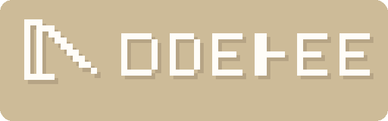

<p align="center">
  
</p>

# Doppel

Synthetic user runtime for experiential testing.

Doppel 试图回答一个被现有测试体系长期遗漏的问题：功能可以跑通，不代表第一次来的用户真的能用起来。

## 1. 项目的由来

过去一年，AI 把做产品的门槛压得很低。一个人、一周末、几个模型，就能把一个网站、一个工作流、一个小工具快速拼出来。问题没有消失，只是转移了。真正昂贵的部分，不再只是“把东西做出来”，而是“确认陌生人第一次看到它时不会直接迷路”。

我们看到一个很稳定的断层：单元测试验证逻辑，集成测试验证协作，E2E 验证预定义路径，人工走查和用户访谈验证真实体验。但在这两类能力之间，缺一层高频、低成本、可重复的体验验证。很多项目上线前知道“按钮能点”，不知道“用户会不会点”；知道“流程存在”，不知道“用户会不会理解这就是主路径”。

Doppel 就是从这个问题里长出来的。它不是为了替代真实用户，而是为了在真实用户到来之前，先放进一个 synthetic user，看它会不会困惑、走偏、放弃。

## 2. 项目愿景

Doppel 的愿景很直接：把“体验预检”变成和单元测试、CI/CD 一样自然的工程动作。

我们希望解决三类问题：产品是否自解释，关键路径是否足够自然，版本迭代是否引入了新的体验回退。更具体地说，Doppel 想让团队在发布前就知道，一个第一次接触产品的人能不能理解它、找到入口、完成任务，还是会在文案、导航、交互和信息结构上被卡住。

长期看，Doppel 想成为一层独立的体验验证基础设施。CLI 只是当前入口；未来的形态可以是 API、Web 界面、发布流程集成，或者团队内部的体验回归基线。

## 3. 适合谁用，以及怎么用

它适合独立开发者、vibe coder、早期创业团队、产品设计师、增长团队，也适合缺少专职 QA 与 UX 研究资源，但又希望在每次迭代前做一轮体验预检的人。

使用方式也很简单：给 Doppel 一个目标产品，一个 persona，一个 mission，再给出几条你关心的 judge criteria。它会在可控 sandbox 中打开产品，以“第一次来的用户”视角执行任务，记录过程，最后输出结构化报告。

如果你的目标是确定某个选择器是否存在、某个接口是否返回 200、某个表单提交后是否跳转正确，那是传统 E2E 的职责。Doppel 更适合问另一类问题：第一次来的用户会不会理解、犹豫、误点、迷路、退出。

## 4. 它是怎么工作的

高层流程只有一条主线：

1. 读取产品配置、judge skill 和 persona 配置，生成一次运行所需的规范化上下文。
2. 准备 sandbox，建立可重复的入口状态，例如入口 URL、测试账号、reset hook、seed state。
3. 启动 synthetic user runtime，让 agent 在浏览器里按 mission 执行一轮 observe-decide-act。
4. 持续记录截图、页面状态、动作、停止原因和运行元数据。
5. 从 session artifacts 中提取 facts，按 criteria 生成评估结果。
6. 输出 `report.md` 和 `report.json`，把行为证据整理成可读结论。

你可以把它理解成：一个带 sandbox 的 synthetic user runner，加上一层基于证据的 judge 和报告生成。

## 5. 和其他框架的差异

和 Playwright、Cypress 这类框架相比，Doppel 的目标不是验证“预先定义好的操作序列能否成功执行”，而是验证“一个陌生用户是否能自然找到并完成任务”。前者是确定性功能验证，后者是体验验证。

和 browser agent、vibe testing、自动网页探索类项目相比，Doppel 强调三件事：第一，sandbox 是一等公民，重点是可重置、可重复、可比较，而不是一次性演示；第二，执行单位是 persona + mission，而不是随便逛一圈；第三，输出不是一段 agent 对话，而是可归档、可对比、可接入流程的结构化 artifacts 和报告。

和人工 UX 走查、可用性测试相比，Doppel 的优势是便宜、快、可高频运行；短板也同样清楚，它不能替代真实用户研究，不能替代访谈、观察和高价值场景下的人类判断。它的角色是提前暴露明显问题，降低把粗糙体验直接交给真实用户的概率。

## 6. 当前版本支持与 Roadmap

当前版本处在 MVP 阶段，已经支持用 synthetic user 去浏览和测试 Web 页面，支持基础 sandbox、artifact 记录、facts 提取、criteria 评估，以及 Markdown 和 JSON 报告输出。

当前版本的 Roadmap 更适合按能力边界理解：

1. 已支持：Web 页面体验测试，远程站点或本地预览环境运行，基础 judge skill 配置，结构化 artifacts 和报告输出。
2. 计划支持：更复杂的 judge skill 组织形式，例如多文件目录、可组合模板、领域化评测包，而不局限于单个 YAML 文件。
3. 计划支持：桌面应用体验测试，包括 macOS 和 Windows 应用，以及在虚拟机中运行目标应用。
4. 计划支持：更强的 sandbox 运行环境，包括隔离账号、seed data、可重置状态和版本对比。
5. 计划支持：接入 GitHub Actions 等 CI/CD 流程，在提交、部署或发布前自动运行体验评测。
6. 计划支持：API、Web UI、批量运行、多 persona 对比和长期体验回归基线。

## 7. 快速开始

### 安装

当前项目使用 Python 3.11+。

```bash
git clone https://github.com/Halucinaut/Doppel
cd Doppel
python3 -m venv .venv
source .venv/bin/activate
pip install -e .[dev]
```

如果你准备运行真实浏览器链路，还需要安装 Playwright 及对应浏览器资源。当前仓库默认假设浏览器资源位于工作区的 `.playwright-browsers` 下。

### 配置

最小运行需要三个输入：

- `product.yaml`：目标产品信息与 sandbox 元数据
- `judge skill`：本次 mission、停止条件、评判标准；当前仓库里先用一个 YAML 文件承载，后续会扩展成更复杂的 skill 包或目录
- `personas.yaml`：用户画像；如果不提供，系统会生成默认 persona

可以直接参考 [`examples/basic`](/Users/sunrx/idea/Doppel/examples/basic)、[`examples/python-org`](/Users/sunrx/idea/Doppel/examples/python-org) 和 [`examples/youtube`](/Users/sunrx/idea/Doppel/examples/youtube)。

一个最小 `product.yaml` 类似这样：

```yaml
name: "PodFlow"
entry_url: "https://example.com"
description: "A podcast listening and discovery platform"

sandbox:
  mode: "remote"
  seed_state: "new_user"
```

当前仓库里，一个最小 judge skill 会先写成 `skill.yaml` 这样的文件：

```yaml
name: "First-time discovery"
version: "1.0"
persona: "newcomer"

mission: |
  You have just arrived at this product for the first time.
  Try to understand what it does and identify the main entry point.

stop_conditions:
  - "You understand the main call to action"
  - "You would leave the product"

judge_criteria:
  - id: "path_efficiency"
    question: "How direct was the path to the primary action?"
    good: "Reached it quickly"
    bad: "Needed too many steps"
```

### 校验配置

```bash
doppel validate \
  --product examples/basic/product.yaml \
  --skill examples/basic/skill.yaml \
  --personas examples/basic/personas.yaml
```

### 启动一次运行

默认模式会跑通主链路并产出 artifacts 与报告：

```bash
doppel run \
  --product examples/basic/product.yaml \
  --skill examples/basic/skill.yaml \
  --personas examples/basic/personas.yaml
```

如果你要显式指定运行时配置：

```bash
doppel run \
  --product examples/basic/product.yaml \
  --skill examples/basic/skill.yaml \
  --personas examples/basic/personas.yaml \
  --runtime-config runtime.local.yaml
```

运行完成后，输出目录里会看到类似这些文件：

- `session.json`
- `run_meta.json`
- `prompt_context.json`
- `facts.json`
- `evaluation.json`
- `report.md`
- `report.json`
- `screenshots/`

## 8. 协议与声明

当前仓库采用 MIT License，具体条款见根目录下的 `LICENSE` 文件。这意味着你可以在保留版权和许可声明的前提下使用、修改、分发和再发布本项目。

声明如下：

- Doppel 的目标是辅助体验预检，不构成质量、合规、安全、可访问性或业务结果保证。
- 它不替代真实用户研究，不替代人工 QA，也不替代生产环境责任判断。
- 当前版本仍处于早期阶段，接口、配置格式、运行行为和报告结构都可能继续变化。
- 如果你在受登录保护、含隐私数据或受合规约束的系统上运行它，应该先自行确认授权、隔离和数据处理边界。
